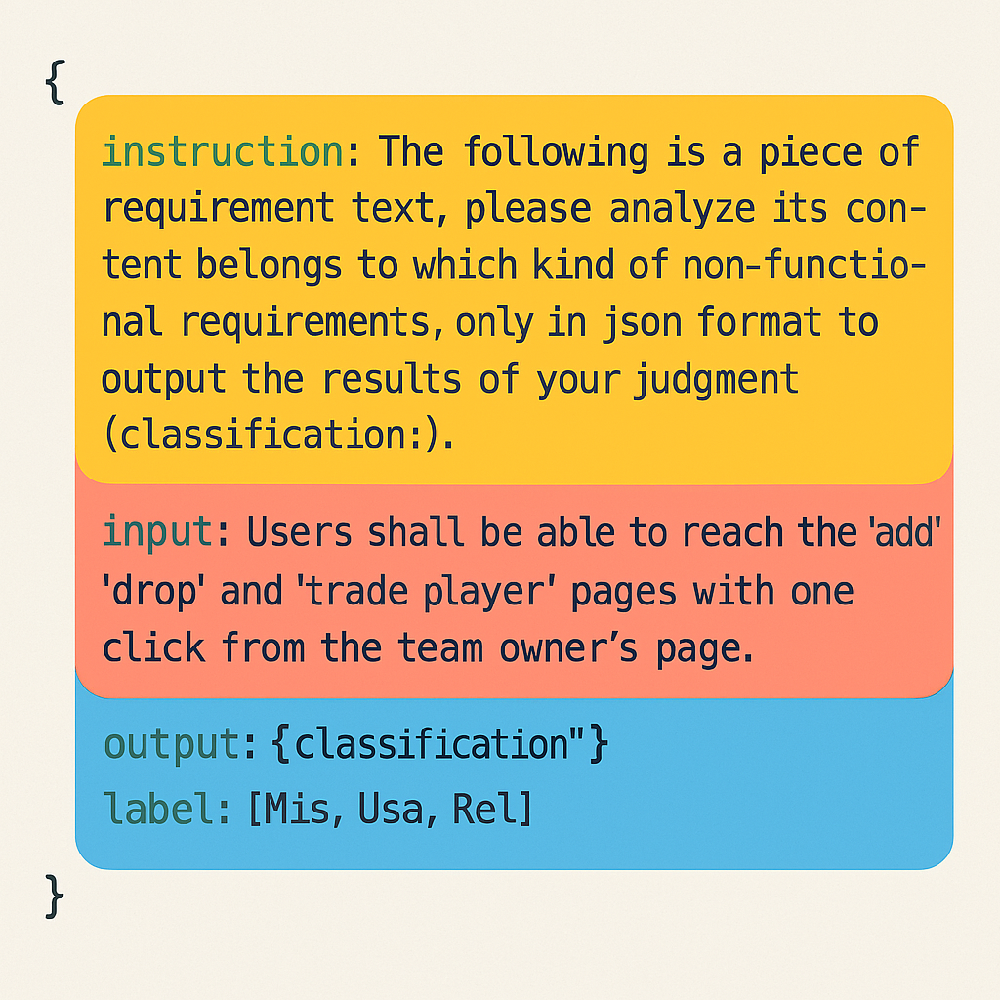

# ML-or-DL-or-LLM-An-Empirical-Study-on-Multi-Label-Requirements-Classification
## ❗ Declaration
This repository contains a summary overview of this paper, as well as the open-source code, data, and experimental results that we have released. 
**We strictly adhere to the double-blind policy. The GitHub account name is just a randomly chosen online name and has nothing to do with anyone!**

## 📑 Overview
- 🧠 Objective: This paper conducts a comprehensive empirical comparison of ML, DL, and LLM-based approaches to assess their effectiveness in requirements
classification. 
- 🎈 Method: The experiments specifically focus on the most challenging multi-label classification (MLC) task, employing the same dataset and four evaluation metrics across all approaches. This study represents the first systematic application of LLMs to automated MLC in the requirement domain.
Result: 
  - The results show that larger parameter sizes do not necessarily result in better performance. The effectiveness of LLMs depends more on their architectural design than on parameter scale alone. 
  - LLMs exhibit significant potential in MLC of requirements under zero-shot scenarios. 
  - Furthermore, in cases of imbalanced multilabel distributions, more complex transfer learning neural networks do not necessarily yield superior performance.
- 🎉 Conclusion: 
These findings suggest that LLM-based MLC of requirements methods represent a promising research direction that may transcend the inherent limitations of
conventional techniques.

## 📊 Dataset
We restructure the EMSE dataset to ensure its compatibility with LLMs.
- The dataset has been processed in Alpaca format, used for the LLM, and stored in the "\data\llm" folder. The refactored template format is as follows:

- The EMSE dataset used for the deep learning baseline is stored in the "data\dl" folder.

## 🚀 Method
Implementation of LoRA fine-tuning based on a generative Large Language Model is located in the "\LLM" folder.

Due to hardware resource limitations, this study focuses on fine-tuning models with smaller parameter counts. Within the sub-32B parameter range, available models include several versions of DeepSeek-R1 (14B, 8B, 7B, 1.5B), Llama-3.2 (3B, 1B), and Llama-3.1 (8B). From this pool, we selected DeepSeek-R1 (14B, 8B), Llama-3.1 (8B), and Llama-3.2 (3B) for a controlled comparative analysis. This selection facilitates the control of key variables to systematically compare: (1) the performance of different model architectures (DeepSeek-R1 vs. Llama-3.1) at the same parameter scale (8B), and (2) the impact of different parameter scales (14B vs. 8B) within the same model architecture (DeepSeek-R1).

### How to fine-tuning the Large Language Model.

1. you need download pretrained LLM model from [huggingface](https://huggingface.co/models).
Eg:
The DeepSeek-R1-Distill-Llama-8B: [deepseek](https://huggingface.co/deepseek-ai/DeepSeek-R1-Distill-Llama-8B)
The Llama-3.1-8B: [Llama3.1](https://huggingface.co/meta-llama/Llama-3.1-8B)

2. After downloading the pre-trained large language model, we implement LoRA fine-tuning using the Llama-factory framework. For specific methods, please refer to the official [LLaMA-Factory](https://llamafactory.readthedocs.io/zh-cn/latest/) documentation.

3. Run `python train_spilt.py ` to splitting training dataset and test dataset.

4. Fine-tuning different large language models with the split EMSE training set in JSON format can be accomplished using the LLaMA-Factory framework, which standardizes the process from environment setup to model inference

5. Run `python run_evuluation.py ` to evaluate the fine-tuned large language models. This script is supported by several key modules: `inference.py` provides both single-sentence and batch-processing modes for model inference; `metrics.py` offers various evaluation metrics for multi-label classification; and `utils.py` handles foundational operations such as loading models, tokenizers, and data preprocessing.

6. Run `examples.py` to execute the large model inference examples.

## 📌 Baselines
Our implemented deep learning baseline codes are stored in the "\Deep learning" folder.

## 📔 Results
The experimental results of all baseline models have been placed in the "\results" folder.

## Acknowledgement
This repo benefits from [LLaMA-Factory](https://github.com/hiyouga/LLaMA-Factory?tab=readme-ov-file#). Thanks for their wonderful works.

## We will keep updating!
