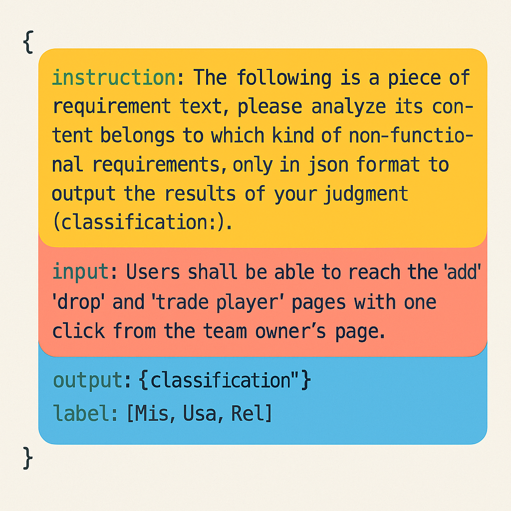
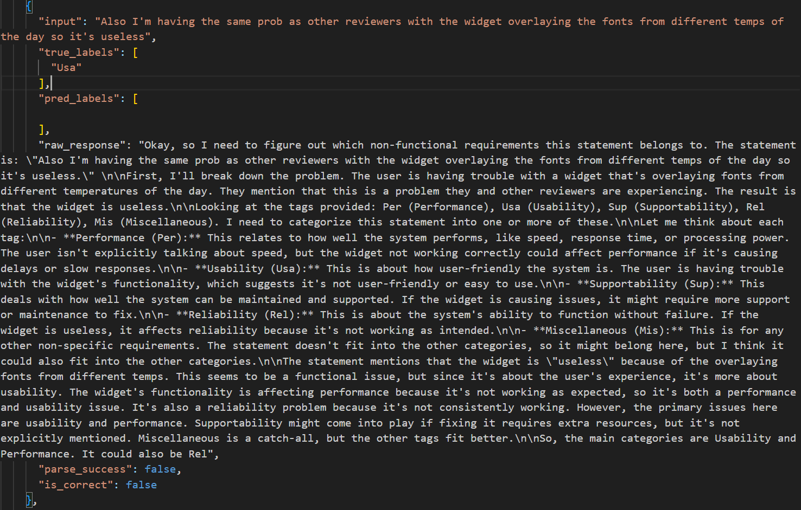
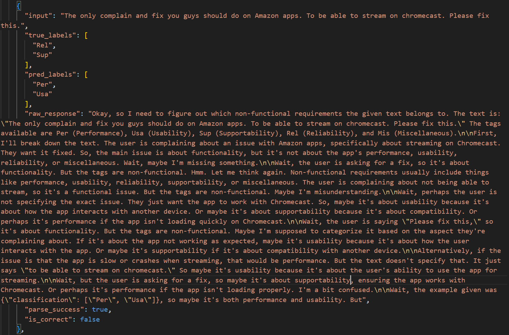
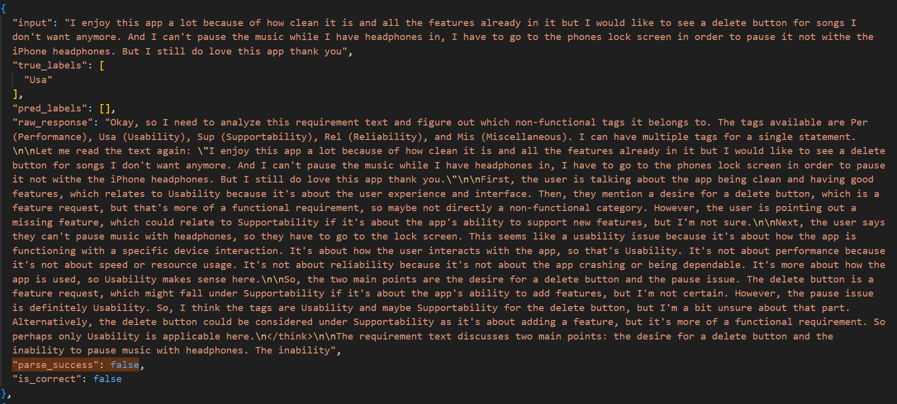
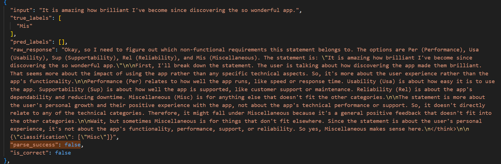
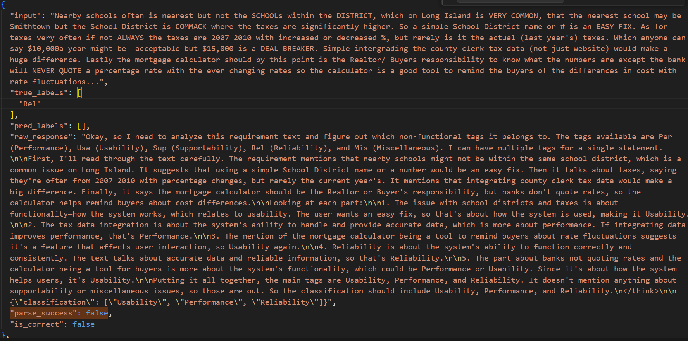
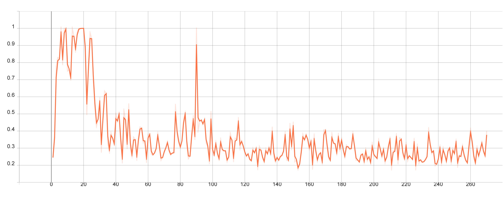
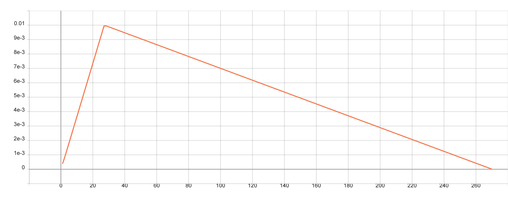
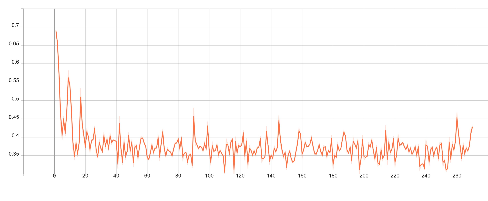

# ML-or-DL-or-LLM-An-Empirical-Study-on-Multi-Label-Requirements-Classification
## ❗ Declaration
This repository contains a summary overview of this paper, as well as the open-source code, data, and experimental results that we have released. 
**We strictly adhere to the double-blind policy. The GitHub account name is just a randomly chosen online name and has nothing to do with anyone!**

## 📑 Overview
- 🧠 Objective: This paper conducts a comprehensive empirical comparison of ML, DL, and LLM-based approaches to assess their effectiveness in requirements
classification. 
- 🎈 Method: The experiments specifically focus on the most challenging multi-label classification (MLC) task, employing the same dataset and four evaluation metrics across all approaches. This study represents the first systematic application of LLMs to automated MLC in the requirement domain.
Result: 
  - The results show that larger parameter sizes do not necessarily result in better performance. The effectiveness of LLMs depends more on their architectural design than on parameter scale alone. 
  - LLMs exhibit significant potential in MLC of requirements under zero-shot scenarios. 
  - Furthermore, in cases of imbalanced multilabel distributions, more complex transfer learning neural networks do not necessarily yield superior performance.
- 🎉 Conclusion: 
These findings suggest that LLM-based MLC of requirements methods represent a promising research direction that may transcend the inherent limitations of
conventional techniques.

## 📊 Dataset
We restructure the EMSE dataset to ensure its compatibility with LLMs.
- The dataset has been processed in Alpaca format, used for the LLM, and stored in the "\data\llm" folder. The refactored template format is as follows:

- The EMSE dataset used for the deep learning baseline is stored in the "data\dl" folder.
- The reconstructed ARBD dataset used for the baselines is stored in the "data\ARBD" folder.

## 🚀 Method
Implementation of LoRA fine-tuning based on a generative Large Language Model is located in the "\LLM" folder.

Due to hardware resource limitations, this study focuses on fine-tuning models with smaller parameter counts. Within the sub-32B parameter range, available models include several versions of DeepSeek-R1 (14B, 8B, 7B, 1.5B), Llama-3.2 (3B, 1B), and Llama-3.1 (8B). From this pool, we selected DeepSeek-R1 (14B, 8B), Llama-3.1 (8B), and Llama-3.2 (3B) for a controlled comparative analysis. This selection facilitates the control of key variables to systematically compare: (1) the performance of different model architectures (DeepSeek-R1 vs. Llama-3.1) at the same parameter scale (8B), and (2) the impact of different parameter scales (14B vs. 8B) within the same model architecture (DeepSeek-R1).

### How to fine-tune the Large Language Model.

1. You need to download the pretrained LLM model from [huggingface](https://huggingface.co/models).
Eg:
The DeepSeek-R1-Distill-Llama-8B: [deepseek](https://huggingface.co/deepseek-ai/DeepSeek-R1-Distill-Llama-8B)
The Llama-3.1-8B: [Llama3.1](https://huggingface.co/meta-llama/Llama-3.1-8B)

2. After downloading the pre-trained large language model, we implement LoRA fine-tuning using the Llama-factory framework. For specific methods, please refer to the official [LLaMA-Factory](https://llamafactory.readthedocs.io/zh-cn/latest/) documentation.

3. Run `python train_spilt.py ` to splitting training dataset and test dataset.

4. Fine-tuning different large language models with the split EMSE training set in JSON format can be accomplished using the LLaMA-Factory framework, which standardizes the process from environment setup to model inference

5. Run `python run_evuluation.py ` to evaluate the fine-tuned large language models. This script is supported by several key modules: `inference.py` provides both single-sentence and batch-processing modes for model inference; `metrics.py` offers various evaluation metrics for multi-label classification; and `utils.py` handles foundational operations such as loading models, tokenizers, and data preprocessing.

6. Run `examples.py` to execute the large model inference examples.

## 📌 Baselines
Our implemented deep learning baseline codes are stored in the "\Deep learning" folder.
NFRNET Configuration（BERT+BiLSTM）：
In the model training and testing phase, we initialized the length of each requirement text to 64 words. If the requirement text is longer than this value, it will be truncated forward, and if it is shorter than this value, it will be filled with 0. The proposed model uses lookahead [22] optimizer. The initial hyperparameters 
are: batch size = 128, learning rate = 0.01, size of N-gram window = 3, dropout = 0.5, and multi-sample dropout regularization technology is used to improve the generalization ability of the model.
MNoR-BERT Configuration:
Batch_size:16, epoches:6, 1 Dense 20, dropout:0.2, Sigmoid
BERT base (L = 12, H = 768, A = 12, total parameter = 110 M) 
BERT Large (L = 24, H = 1024, A = 16, total parameter = 340 M).
Where, L denotes number of layers (transformer blocks), H is the hidden size and A is attention tasks.

## 📔 Results
The experimental results of all baseline models have been placed in the "\results" folder.

## 📊 Case analysis
We analyzed classification failure cases in pure reasoning models using CoT (such as Deepseek-R1-14B) and identified the following types:
1. Reasoning is too long. Reasoning exceeded the maximum truncation length, resulting in excessive resource consumption. The system automatically truncated the output, preventing the final result from being displayed. The reasoning process is as follows:
2. Over-reasoning. After completing the inference and outputting the answer, the model continues to generate additional responses, exhibiting over-reasoning that leads to confusion in the final answer. The reasoning process is illustrated as shown in the figure：
3. After thinking, no answer was output. Thinking models like Deepseek typically output the reasoning process within <think></think> tags, followed by the final answer after the </think> tag. However, in some cases, the model's output becomes confused after completing its thought process, leading to classification errors. As shown in the figure:
4. Label format error. In this paper, the prediction labels are constrained using the JSON format {classification:[Usa,Per,Rel,Sup,Mis]}. In some cases, incorrect prediction labels have appeared, such as “Misc.” As shown in the figure:
As stated in point 4, predicted labels must fall within the set [Usa, Per, Rel, Sup, Mis]. In some cases, the label prediction format is incorrect, resulting in the appearance of non-functional requirement names, as shown in the figure:

 ## 📊 Deep Learning Model failure analysis
we extracted and plotted the training dynamics (Step Loss, Gradient Norm, and Learning Rate) for the completely failed baselines (e.g., the original NFRNet configuration) and have included these plots，as shown in the figures:  

Our quantitative analysis of these plots revealed that our initial hypothesis was inaccurate. The gradient norm (grad_norm) did not explode to infinity or NaN, but rather remained within a relatively small range (peaking around 1.0). Instead, the data reveals that the failure was caused by optimization oscillation leading to representation collapse. Because the original baseline configuration utilized an excessively aggressive learning rate (1e-2) on a highly imbalanced dataset, the model’s loss dropped rapidly at first but then immediately plateaued. The model essentially took overly large optimization steps, jumping over the nuanced local minima of minority classes, and quickly collapsed into a degenerate state where it failed to make any confident multi-label predictions.

## Acknowledgement
This repo benefits from [LLaMA-Factory](https://github.com/hiyouga/LLaMA-Factory?tab=readme-ov-file#). Thanks for their wonderful works.

## We will keep updating!
